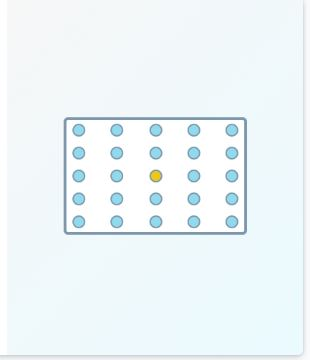
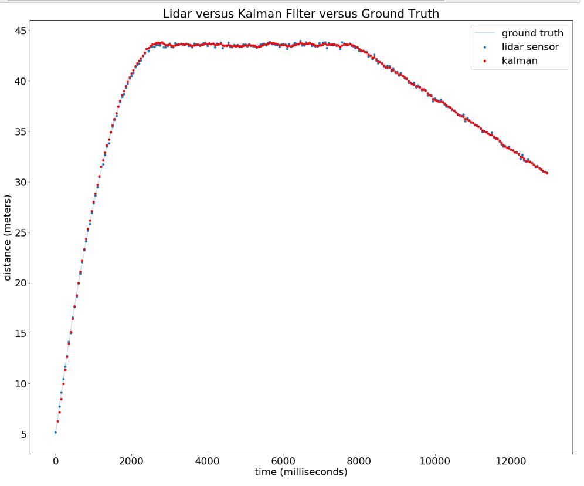
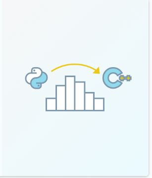
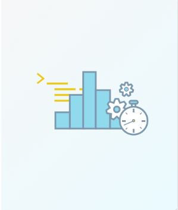
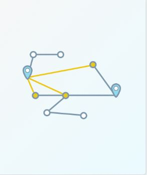
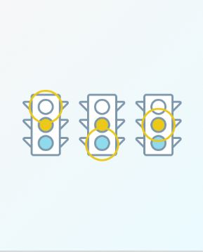

# self-driving-car

In this repository I share **my source code** of all the projects from **[Udacity Intro to Self-Driving Cars Nanodegree Program](https://classroom.udacity.com/nanodegrees/nd113/dashboard/overview)**.

## Overview

### Projects

<table style="width:100%">
  <tr>
    <th>
      

           
            P1: Histogram Filter
            <a href="./Project_1_Histogram_Filter_in_Python" name="p1_code">(project)</a>
      

    </th>
        <th>

           
            P2: Kalman Filter
            <a href="./Project_2_Kalman_Filter" name="p2_code">(project)</a>
        

    </th>
       <th>

           
            P3: Python to C++
            <a href="./Project_3_Translate_Python_to_C++" name="p3_code">(project)</a>
        

    </th>
        <th>

           
            P4: Optimize Histogram Filter
            <a href="./Project_4_Optimize_Histogram_Filter" name="p4_code">(project)</a>
        

    </th>
  </tr>
  <tr>
    <th>

           
            P5: Route Planner
            <a href="./Project_5_Route_Planner" name="p5_code">(project)</a>
        

    </th>
        <th>

           
            P6: Reconstruction_Trajectories
            <a href="./Project_6_Reconstruction_Trajectories" name="p6_code">(project)</a>
        

    </th>
    <th>

           
            P7: Traffic Light Classifier
            <a href="./Project_7_Traffic_Light" name="p7_code">(project)</a>
        

    </th>
  </tr>
</table>

--- 
## Table of Contents

#### [P1 - Histogram Filter in Python](Project_1_Histogram_Filter_in_Python)
 - **Summary:** Write the `sense` and `move` functions for a 2 dimensional histogram filter
 - **Keywords:** Python, Localisation
 
#### [P2 - Kalman Filter](Project_2_Kalman_Filter)
 - **Summary:** Using Kalman filters to smooth out the data to make more accurate predictions in object tracking.One of the most interesting benefits of Kalman filters is that they can give you insights into variables that you cannot directly measured. Although lidar does not directly give velocity information, the Kalman filter can infer velocity from the lidar measurements.
 - **Keywords:** Kalman Filter, Matrix Class
 
#### [P3 - Translate Python to C++](Project_3_Translate_Python_to_C++)
 - **Summary:** The goal of this project is to take the python code you wrote when you implemented the two dimensional histogram filter and translate it into C++.
 - **Keywords:** Python, C++
#### [P4 - Optimize Histogram Filter](Project_4_Optimize_Histogram_Filter)
 - **Summary:** Optimize C++ code, to get the histogram filter code to run faster. I was able to reduce the execution time from 350ms to only 2ms, using several optimized methodes. 
 - **Keywords:** C++, Code Optimization
 
#### [P5 - Route Planner](Project_5_Route_Planner)
 - **Summary:** Implement a Google-maps style routing algorithm using A star search. 
 - **Keywords:** Pathfinding Algorithm, Best-first search, Uniform cost search
 
 #### [P6 - Reconstructing Trajectories from Sensor Data](Project_6_Reconstruction_Trajectories)
 - **Summary:** Use raw acceleration ,displacement and angular rotation data from a vehicle's accelerometer, odometer and rate gyros to reconstruct a vehicle's X, Y trajectory.
 - **Keywords:** Python, Vehicle Motion and Control

 #### [P7 - Traffic Light Classifier](Project_7_Traffic_Light)
 - **Summary:** Build a classification pipeline that takes in an image of a traffic and outputs a label that classifies the image as red, green or yello light. I achieved a accuracy of 97.6%, 7 misclassified images out of 297 total images.
 - **Keywords:** Computer Vision, Machine Learning
 

  

